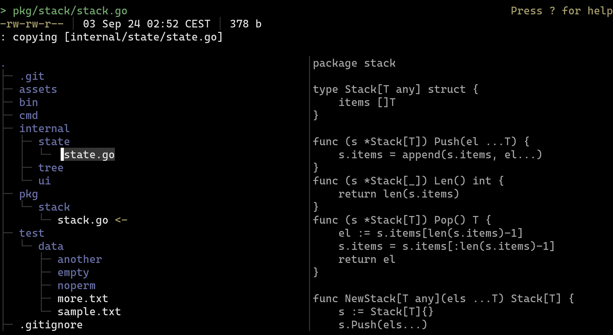

# Better tree (arguably)

Navigate file tree in terminal.



## Installation

Currently the only way to install is by building from source...

```bash
go build .
mv ./bt ~/.local/bin/bt
```

## Usage

```bash
> bt -h
Usage of bt:
  -i    In-place render (without alternate screen)
  -pad uint
        Edge padding for top and bottom (default 5)
```

Key bindings:

| key           | desc                                                   |
|---------------|--------------------------------------------------------|
| j / arr down  | Select next child                                      |
| k / arr up    | Select previous child                                  |
| h / arr left  | Move up a dir                                          |
| l / arr right | Enter selected directory                               |
| gg            | Go to top most child in current directory              |
| G             | Go to last child in current directory                  |
| d             | Move selected child (then 'p' to paste)                |
| y             | Copy selected child (then 'p' to paste)                |
| D             | Delete selected child                                  |
| if / id       | Create file (if) / directory (id) in current directory |
| r             | Rename selected child                                  |

---

```
todo:
- [x] Tree rendering
- [x] File preview
- [x] Scrolling trees, that don't fit the screen
- [x] Move files
- [x] Fix current on file movement to directory which is after it
- [x] Jump into empty directories
- [x] Copy / paste files
- [x] Not reading whole file contents, only fix size
- [x] Fix strange offset with empty dir
- [x] Remove files
- [~] Resolve filename conflicts (kinda done)
- [x] Sorting
- [x] "G" to go bottom and "gg" to go top
- [x] Creating files and directories
- [x] Renaming files and directories
- [ ] Better style

- [ ] Sorting function as a flag?
- [ ] Inline file permissions and size?
- [ ] Handle fs updates?

- [ ] Project structure
- [ ] Tests
```
